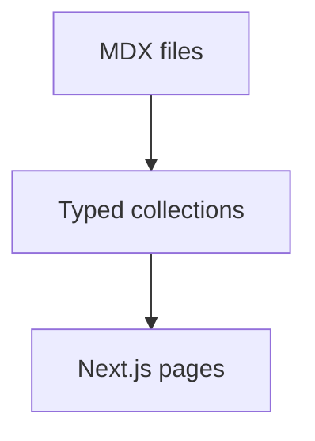

# Content Guide

This site uses MDX files in `content/` with typed frontmatter generated by Content Collections.

## Add a Project

Create `content/projects/my-project.mdx`.

Required frontmatter:

```yaml
title: 'My Project'
slug: 'my-project'
description: 'Short card and page summary.'
category: 'product'
maturity: 'active'
status: 'in-progress'
visibility: 'public'
dates:
  year: 2026
  started: '2026-01-01'
  updated: '2026-06-30'
role: 'What you did.'
tags: ['Architecture', 'Product']
scope: ['Domain modeling', 'Interface design']
featured: false
links:
  - label: 'View project'
    url: '/projects/my-project'
relatedCaseStudies: []
```

Use MDX below the frontmatter for the page body. Read time is computed automatically from the MDX body during the content build.

Available MDX components include the shared block components and a few writing-friendly aliases:

- `SectionTitle`
- `SectionMarker` for horizontal in-page markers
- `SectionRail` for the original vertical rail marker
- `Callout` / `CalloutNote`
- `PullQuote` / `Quote`
- `DecisionCard` / `Decision`
- `ConstraintBlock` / `Constraint`
- `TradeOffCard` / `TradeOff`
- `ReflectionBlock` / `Reflection`
- `MetricCard` / `Metric`
- `StatGrid` / `MetricGrid`
- `TimelineItem`
- `Timeline`
- `DiagramPlaceholder` / `Diagram` / `ProcessDiagram`
- `GalleryGrid`
- `ProjectGallery`
- `ImageGrid`
- `TechStack`
- `RenderSection`
- `MermaidDiagram`
- `CodeBlock`

Example:

```mdx
<Decision
  title="How should tenant isolation work?"
  teaser="Shared infrastructure keeps cost down, but payroll data needs strict boundaries."
  answer="Tenant identity belongs in the data model and every query boundary."
  alternatives={['Separate databases per tenant', 'Application-only filtering']}
/>

<Timeline
  items={[
    {
      date: 'Jan 2026',
      title: 'Discovery',
      description: 'Mapped constraints before writing implementation code.',
    },
  ]}
/>
```

Diagrams can be written as a component:

```mdx
<MermaidDiagram
  title="Content flow"
  chart={`graph TD
    MDX[MDX files] --> Collections[Typed collections]
    Collections --> Pages[Next.js pages]
  `}
/>
```

Or as a fenced Mermaid block:

````mdx

````

Regular fenced code blocks are rendered with the polished MDX code block component automatically.

## Visibility

Use `visibility` when you want to take content down without deleting the MDX file.

```yaml
visibility: 'public'
```

Options:

- `public`: appears in indexes, gets detail routes, and appears in the sitemap.
- `hidden`: does not appear in indexes or the sitemap, but the direct detail route still works.
- `draft`: appears in indexes as a disabled `Coming soon` card and does not get a detail route.

## Add a Case Study

Create `content/case-studies/my-case-study.mdx` and include `projectSlug`.

```yaml
title: 'My Case Study'
slug: 'my-case-study'
description: 'What this study explains.'
category: 'research'
maturity: 'concept'
status: 'concept'
visibility: 'public'
dates:
  published: '2026-06-30'
projectSlug: 'my-project'
tags: ['Systems']
featured: true
links:
  - label: 'Back to project'
    url: '/projects/my-project'
```

Then add the case study slug to the parent project's `relatedCaseStudies`.

## Add an Article

Create `content/articles/my-article.mdx` with the same base fields. Add `dates.published` when it is ready to appear in writing views. Use `dates.updated` when you materially revise an older piece.

```yaml
title: 'My Article'
slug: 'my-article'
description: 'Short summary.'
category: 'research'
maturity: 'concept'
status: 'draft'
visibility: 'draft'
dates:
  published: '2026-06-30'
  updated: '2026-06-30'
tags: ['Systems']
featured: false
links: []
```

After content changes, `next dev` and `next build` regenerate the typed collection module automatically. For standalone type checks, run `pnpm content:build` first.
