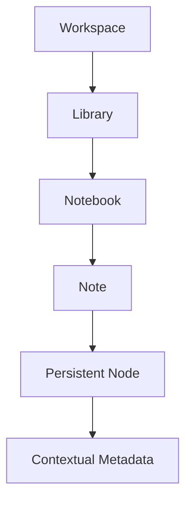

## What Is Synapcity?

Synapcity is a long-term exploration into building a more contextual and composable productivity system.

The project began as a traditional note-taking application, but gradually evolved into a broader workspace platform focused on:

- persistent knowledge structures
- contextual organization
- modular dashboards
- scoped personalization
- extensible editor tooling
- scalable frontend architecture

Rather than treating documents as isolated containers, Synapcity approaches knowledge as a connected system of contextual entities.

Notes, widgets, resources, metadata, and relationships are designed to exist within the specific context that created them.

<SectionMarker>Overview</SectionMarker>

<Callout title="Core Philosophy" tone="discovery">

Knowledge loses meaning when removed from its original context.

A comment attached to an entire document eventually becomes ambiguous.

A comment attached directly to the paragraph, idea, or concept that created it remains meaningful over time.

</Callout>

Most productivity platforms organize information around disconnected documents, pages, or tools.

As projects scale, information becomes increasingly fragmented:

- notes become difficult to navigate
- metadata becomes detached from its source
- relationships disappear
- context is lost
- personalization remains superficial
- workflows spread across multiple applications

Traditional workspace tools also tend to treat customization as a visual layer rather than an architectural capability.

I wanted to explore what happens when:

- context becomes a first-class concern
- workspace composition becomes modular
- personalization becomes hierarchical
- persistent structures replace disposable formatting

---

<SectionMarker>Architecture</SectionMarker>

## Core Architecture

The application is built around several interconnected systems:

- persistent editor nodes
- contextual metadata
- modular widgets
- scoped theming
- dynamic layouts
- reusable state infrastructure

Together, these systems allow different parts of the workspace to remain independently customizable while still participating in a unified architecture.

<ProcessDiagram
  label="Workspace → Libraries → Notebooks → Notes → Persistent Nodes → Contextual Metadata"
  caption="Knowledge is organized hierarchically while remaining context-aware at the node level."
/>

---

## Persistent Node Model

One of the most important architectural decisions in Synapcity was treating persistent editor nodes as primary entities instead of temporary editor structures.

Every heading, paragraph, and contextual block can own stable identifiers independent of Lexical runtime node keys.

This enables:

- contextual annotations
- sidebar-linked resources
- persistent relationships
- future graph structures
- AI-generated summaries
- contextual metadata ownership

<Decision
  title="What should be the primary knowledge entity?"
  teaser="Most editors treat documents as the primary object."
  answer="Synapcity treats persistent contextual nodes as the primary entity while documents act as containers."
  alternatives={[
    'Traditional document-centric model',
    'Page-based metadata systems',
    'Pure graph-first architecture',
  ]}
/>

---

## Scoped Theming System

As the application evolved, theming requirements became significantly more complex than a traditional global dark/light mode.

Different scopes required independent customization:

- global application themes
- dashboard themes
- widget overrides
- note personalization
- scoped typography
- runtime inheritance

The system eventually evolved toward hierarchical theme inheritance using semantic CSS variables and runtime synchronization through Zustand.

This approach dramatically reduced duplicated styling logic while improving consistency, scalability, and runtime performance.

<TradeOff
  title="Independent themes vs inherited scopes"
  decision="Hierarchical theme inheritance"
  pros={[
    'Reduced duplication',
    'Predictable fallback behavior',
    'Improved runtime performance',
    'Cleaner mental model',
  ]}
  cons={[
    'More complex resolution logic',
    'Requires carefully designed token hierarchy',
  ]}
/>

---

## Modular Widget Infrastructure

Synapcity’s dashboard system evolved from isolated widgets into a modular workspace infrastructure.

Widgets are treated as configurable workspace modules capable of:

- persistence
- resizing
- synchronization
- scoped settings
- shared controls
- contextual rendering
- dashboard composition

This architectural shift transformed widgets from simple UI components into reusable infrastructure participants inside a larger workspace ecosystem.

<ProcessDiagram
  label="Widget Registry → Dashboard Layout → Widget Instance → Scoped State → Shared Infrastructure"
  caption="Widgets evolved into composable infrastructure modules rather than isolated components."
/>

## State Architecture

The application uses Zustand extensively for scalable client-side state management.

Over time, the architecture evolved from feature-oriented stores toward reusable infrastructure patterns:

- normalized entities
- modular slices
- scoped state
- reusable update utilities
- persistence abstractions
- synchronized runtime behavior

The project intentionally separates:

- domain state
- UI state
- runtime interaction state

to reduce coupling and improve long-term maintainability.

<Timeline
  items={[
    {
      date: 'Phase 1',
      title: 'Feature-Oriented Stores',
      description:
        'Initial state architecture focused primarily on isolated feature stores and localized updates.',
    },
    {
      date: 'Phase 2',
      title: 'Reusable Store Patterns',
      description:
        'Repeated CRUD and synchronization patterns led to reusable abstractions and normalized entity structures.',
    },
    {
      date: 'Phase 3',
      title: 'Infrastructure-Driven Architecture',
      description:
        'The system evolved toward generic store factories, modular slices, and scoped synchronization patterns.',
    },
  ]}
/>

## Technology

### Technology Stack

<TechStack
  items={[
    'Next.js 15',
    'React',
    'TypeScript',
    'Tailwind CSS',
    'Zustand',
    'Lexical',
    'Framer Motion',
    'Supabase',
    'PostgreSQL',
    'Zod',
  ]}
/>

### Challenges

Some of the most significant architectural challenges included:

- designing stable contextual node systems
- synchronizing scoped runtime themes
- scaling state architecture without monolithic stores
- balancing extensibility with maintainability
- supporting dynamic dashboard composition
- preserving editor performance while adding contextual infrastructure
- maintaining consistent UX across highly customizable interfaces

<Constraint
  title="Scalability vs Overengineering"
  description="The project required balancing long-term extensibility with MVP development speed. Many systems were intentionally redesigned multiple times as architectural patterns became clearer."
/>

<SectionMarker>Reflection</SectionMarker>

## Key Lessons

One of the biggest lessons from building Synapcity was realizing that most complexity did not come from rendering interfaces.

The real complexity emerged from preserving relationships, context, and extensibility as the application became increasingly modular.

Many systems initially appeared simple:

- theming
- widgets
- editor state
- layouts
- sidebars

but became significantly more architectural as the platform evolved.

The project reinforced the importance of:

- scalable abstractions
- hierarchical systems
- normalized data models
- reusable infrastructure
- designing around context instead of isolated features

<Reflection
title="Most Important Realization"
summary="The difficult part was never building an editor."

>

The difficult part was designing systems capable of preserving contextual relationships over time while remaining flexible enough to evolve alongside the product itself.

</Reflection>

---

<PullQuote attribution="Project Vision">

The goal is not simply to build another productivity application.

The goal is to build a contextual workspace system where knowledge, relationships, and workflows remain connected to the environment that created them.

</PullQuote>
